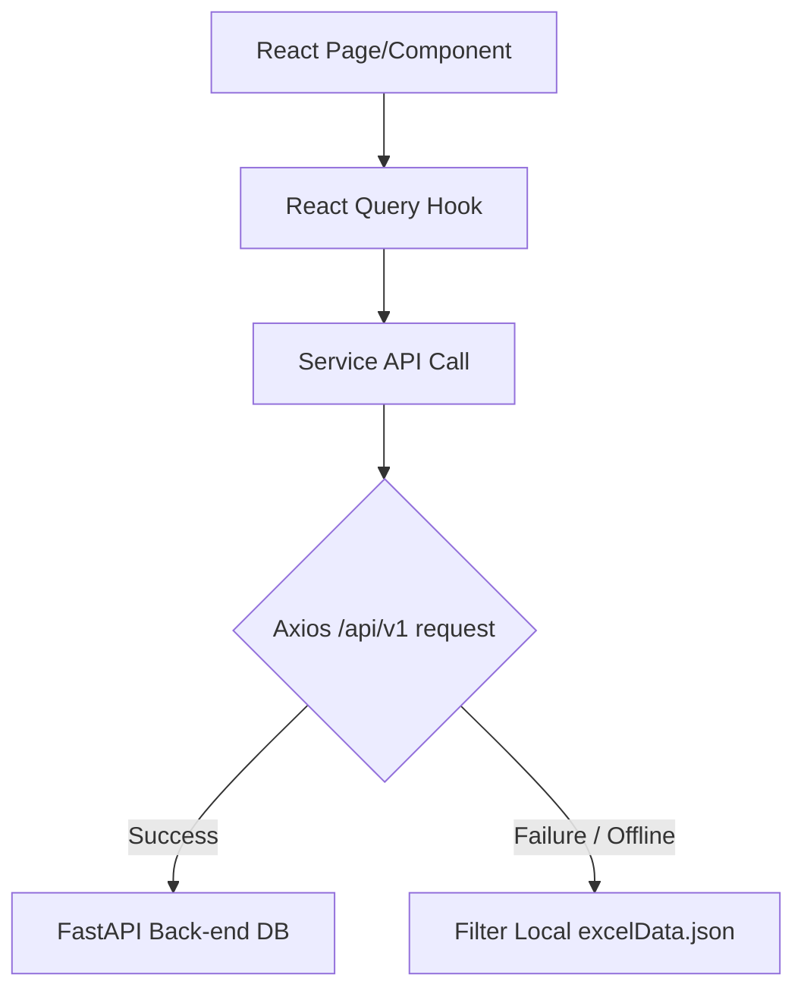

# ORBIT Portal - Project Overview & Developer Documentation

This document serves as a comprehensive system blueprint and code map for the **Orbit Resource Management Portal** (GFO project). It captures the application architecture, design systems, data strategies, and code pathways to align other developer agents or external AI systems (such as ChatGPT) with this repository.

---

## 1. Project Metadata & Technical Stack

* **Project Name**: ORBIT Resource Management & Field Mobility Hub
* **Frontend Core**: React 18+ (with TypeScript `tsconfig.json` modules)
* **Build & Dev Tooling**: Vite 6+
* **Styling & Theme Engine**: Tailwind CSS v3 + Vanilla CSS Variables (dynamic injection)
* **Routing**: React Router v7 (`react-router-dom`)
* **State Management & Fetching**: TanStack React Query v5 & Axios interceptors
* **Visualization**: Recharts (for executive dashboards, trendlines, and workforce donut charts)
* **Animation & Icons**: Framer Motion & Lucide React

---

## 2. Multi-Tenant Theme & Design System

The application implements a unique theme injection framework driven by the selected tenant (company workspace).

### Theme Tokens (`src/context/CompanyContext.tsx` & `ThemeContext.tsx`)
1. Active workspace defaults to `LAM Research` (`lam-research`) or `Axcelis Technologies` (`axcelis`). An administrator can also view `Master All Data` (`all-data`).
2. When the tenant changes:
   - CSS variables (e.g., `--color-primary`, `--color-secondary`, `--color-sidebar`, `--color-bg`, `--color-text-primary`) are dynamically written directly to `document.documentElement.style`.
   - Tailwind styles reference these custom CSS variables (as declared in `tailwind.config.js`).
   - The UI modifies its primary branding colors, text shades, panel background, and sidebar colors seamlessly in real-time.
3. The sidebar icons are kept uniformly in bright white for a sleek dark panel appearance regardless of background.

---

## 3. Persistent Layout & UX Collapsible Sidebar

### Collapse Mechanics (`src/components/layout/AppLayout.tsx`)
* The application houses a persistent layout containing a `Header`, `Sidebar`, and `main` layout wrapper.
* **Auto-Collapse Behavior**: When a user navigates to the **Engineer Search Page** (`/engineer-search`), the sidebar automatically minimizes (collapses to `w-16`) to maximize search and filter grid real estate.
* **State Restoration**: The layout tracks the user's prior layout preference (`userCollapsedPref`). If they had the sidebar expanded, it automatically expands back to full size (`w-60`) the moment they navigate away from `/engineer-search`.

---

## 4. Double-Layered Data Strategy (Local JSON Fallback)

To enable offline demonstration, sandbox development, and full production integration, services implement a fallback framework.



1. **Services** (`src/services/`): API wrappers (like `getEngineers`, `getEngineerById`, `createEngineer`, etc.) use an Axios client configuration (`axios.ts`).
2. **Axios Client** (`src/services/axios.ts`):
   - Injects the Bearer JWT token from `localStorage` under `ormp_auth_token`.
   - Injects the active tenant header `X-Company-ID` (`ormp_active_company`).
3. **Graceful Fallback**: If the Axios request fails (API backend is offline or returns HTML fallback pages), the catch block takes over, query-filtering the large static dataset loaded directly from `src/data/excelData.json`.

---

## 5. Directory & File Blueprint

```text
d:\GFO
├── packages.json                # Dependencies, tsc and vite build scripts
├── postcss.config.js            # PostCSS utility configuration
├── tailwind.config.js           # Tailwind mapping to CSS variable tokens
├── tsconfig.json                # TS config setups
├── index.html                   # HTML Entry template
├── dist/                        # Production build output
├── public/                      # Static assets & public templates
└── src/
    ├── main.tsx                 # Core application mounting
    ├── index.css                # Global styles and tailwind directives
    ├── App.tsx                  # Main router setup & Context Provider tree
    ├── App.css                  # Core CSS styling overrides
    │
    ├── assets/                  # Images, logos, SVG graphics
    │
    ├── context/                 # State providers
    │   ├── AuthContext.tsx      # User authentication state & mock login functions
    │   ├── CompanyContext.tsx   # Switchable multi-tenant styling settings
    │   ├── ThemeContext.tsx     # Layout design tokens
    │   └── UserContext.tsx      # Logged-in profile data
    │
    ├── data/
    │   └── excelData.json       # Mock semiconductor roster, visas, travels dataset (~500KB)
    │
    ├── types/
    │   └── index.ts             # Complete domain model interfaces (Engineer, Visa, Skill, etc.)
    │
    ├── hooks/                   # React Query query hooks
    │   ├── useEngineers.ts      # Query keys and hooks for engineers page
    │   ├── usePerformance.ts    # Performance analytics query
    │   ├── useReports.ts        # Operations reporting
    │   ├── useSchedule.ts       # Installation schedule calendars
    │   ├── useTravel.ts         # Flight tracking
    │   ├── useUpload.ts         # xlsx sheet parsing
    │   └── useVisa.ts           # Passport & Visa expiries
    │
    ├── services/                # Backend API communication clients
    │   ├── axios.ts             # Interceptors for headers & JWT tokens
    │   ├── company.ts           # Company services
    │   ├── engineers.ts         # Engineer endpoints (with local fallback filtering)
    │   ├── performance.ts       # Performance metrics
    │   ├── reports.ts           # CSV/XLSX summary triggers
    │   ├── schedule.ts          # Shift planners
    │   ├── travel.ts            # Flights roster
    │   ├── upload.ts            # Excel file ingestion endpoints
    │   └── visa.ts              # Visa registries
    │
    ├── components/              # Modular UI elements
    │   ├── common/
    │   │   ├── EmptyState.tsx   # Standardized zero-state component
    │   │   ├── ErrorState.tsx   # Red alert error box
    │   │   ├── GlobalSearch.tsx # Header & page keyword filter search bar
    │   │   ├── LoadingSkeleton. # Pulse loader layout card placeholders
    │   │   ├── StatCard.tsx     # Grid metrics statistics card (supports trends)
    │   │   └── Table.tsx        # Styled responsive data grid
    │   ├── forms/
    │   │   ├── Button.tsx       # Accent action buttons
    │   │   ├── DatePicker.tsx   # Date selectors
    │   │   ├── Dropdown.tsx     # Custom styled combobox selectors
    │   │   ├── FileUpload.tsx   # Drag and drop sheet dropzone
    │   │   ├── Modal.tsx        # Dynamic dialog container
    │   │   └── TextInput.tsx    # Styled form controls
    │   └── layout/
    │       ├── AppLayout.tsx    # Global header/sidebar layout grid wrapper
    │       ├── Header.tsx       # Logo, switch-tenant menu, user profile controls
    │       ├── PageHeader.tsx   # Responsive title, subtitle, and CTA toolbar
    │       └── Sidebar.tsx      # Sidebar routes links and collapse chevron
    │
    └── pages/                   # Views rendered inside AppLayout Outlet
        ├── LoginPage.tsx        # Glassmorphic Login page
        ├── CompanySelectionPage.# Workspace tenant gatepicker
        ├── DashboardPage.tsx    # Charts overview, KPIs, action triggers
        ├── AllDataPage.tsx      # Aggregated master views
        ├── EngineerSearchPage.  # Filters sidebar + grid talent catalog
        ├── EngineersPage.tsx    # Full personnel database table
        ├── EngineerProfilePage. # Profile tabs (Skills, Schedule, Visa, Flights)
        ├── SchedulePage.tsx     # Work roster
        ├── SkillsPage.tsx       # Semiconductor matrices
        ├── TravelPage.tsx       # Flight calendars
        ├── VisaPage.tsx         # Visa tracking and expiration alerts
        ├── PerformancePage.tsx  # Customer rating trends
        ├── ReportsPage.tsx      # Export logs
        ├── UploadPage.tsx       # excelData ingestion dashboard
        ├── SettingsPage.tsx     # Roster profiles & account settings
        └── NotFoundPage.tsx     # Custom 404
```

---

## 6. Configured Routing Matrix (`src/App.tsx`)

| Path | Component | Auth Role / Guard | Purpose |
| :--- | :--- | :--- | :--- |
| `/` | `LoginPage` | Public | Centered glassmorphic login card |
| `/company-selection` | `CompanySelectionPage` | Public / Gatekeeper | Company workspace selection |
| `/dashboard` | `DashboardPage` | Private (`AppLayout`) | Main KPI charts overview |
| `/all-data` | `AllDataPage` | Private (`AppLayout`) | Aggregate multi-company view |
| `/engineer-search` | `EngineerSearchPage` | Private (`AppLayout`) | Personnel search (sidebar collapses here) |
| `/engineers` | `EngineersPage` | Private (`AppLayout`) | Database table layout |
| `/engineers/:id` | `EngineerProfilePage` | Private (`AppLayout`) | Multi-tab dossier details |
| `/schedule` | `SchedulePage` | Private (`AppLayout`) | Installations schedules |
| `/skills` | `SkillsPage` | Private (`AppLayout`) | Tool certification matrices |
| `/travel` | `TravelPage` | Private (`AppLayout`) | Visa & travel calendars |
| `/visa` | `VisaPage` | Private (`AppLayout`) | Expiry alerts |
| `/performance` | `PerformancePage` | Private (`AppLayout`) | Satisfaction metrics |
| `/reports` | `ReportsPage` | Private (`AppLayout`) | Spreadsheet summary exports |
| `/upload` | `UploadPage` | Private (`AppLayout`) | Drag-and-drop xlsx processor |
| `/settings` | `SettingsPage` | Private (`AppLayout`) | Account configuration settings |

---

## 7. Key React Hook & Query Definitions

Every major feature uses a dedicated hook file containing TanStack React Query triggers:
* **`useEngineers(params)`**: Automatically queries `/engineers` passing limits, pagination, and parameters, caching responses. Refetches instantly when search states transition.
* **`useVisa()`**: Filters expiring visa registries, updating the top warning header on dashboard cards.
* **`useTravel()`**: Queries transport and booking arrangements.
* **`useUpload()`**: Sends file payloads to `/upload` endpoints.
